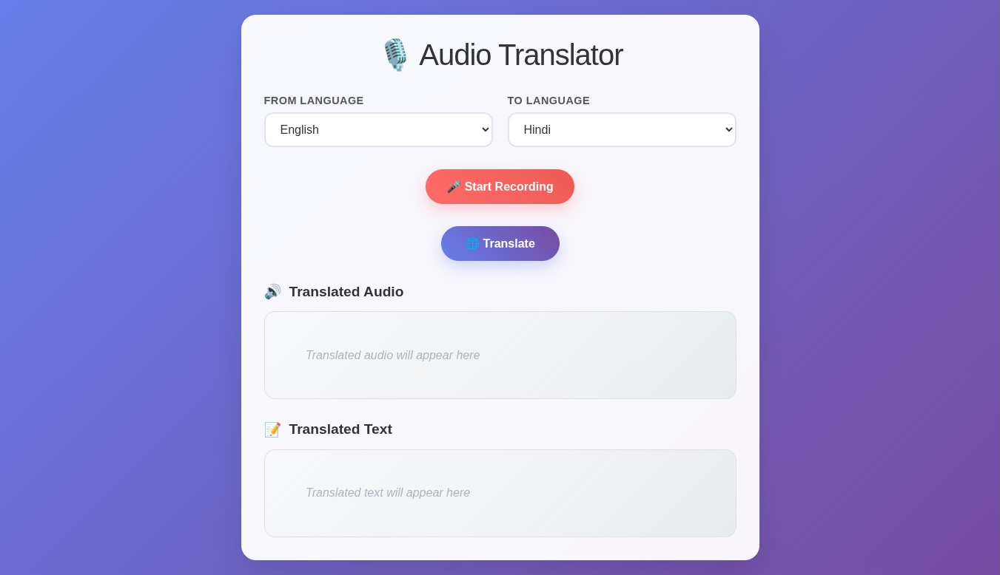
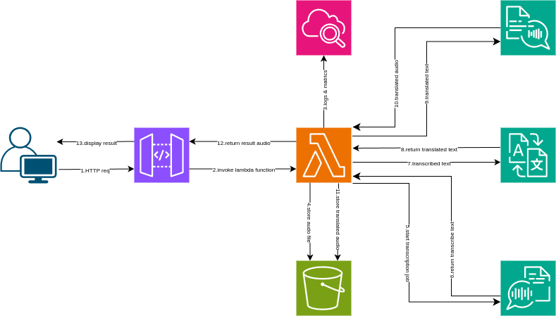

# 🌐 AWS Serverless Translator

Welcome to the **AWS Serverless Translator**! 🚀  
A web-based application leveraging AWS serverless services for real-time text translation—showcasing a blend of modern frontend and cloud-native backend.

---

## 🎨 Preview

  
*Your serverless translation service, at your fingertips!*

---

## ✨ Features

- 🔄 **Text Translation** – Instantly translate phrases using AWS.
- 💻 **Modern Web UI** – Clean & responsive interface (HTML, CSS, JS).
- ☁️ **Serverless Scaling** – Powered by AWS Lambda & pay-per-use.
- 🛠️ **Zero Server Management** – No complex backend setup, all on AWS.
- 🌍 **Multilingual** – Add or extend to more languages easily.

---

## 📁 Project Structure

| File/Folder   | Purpose                                                      |
| ------------- | ------------------------------------------------------------ |
| `index.html`  | Main HTML – user interface for translation.                  |
| `script.js`   | Client-side logic; talks to AWS + handles translation.       |
| `style.css`   | App styling and layout.                                      |
| `Architecture`|                           |
| `README.md`   | Project documentation (you’re reading it!).                  |

---

## ⚙️ Prerequisites

- 🪣 AWS account with permissions for Lambda & Translate.
- (Optional) S3 bucket if hosting frontend.
- 🟩 Node.js & npm (for development/deployment).

---

## 🚀 Getting Started

1. **Clone the Repository**
    ```
    git clone https://github.com/Arvind-26/AWS-Serverless-Translator.git
    cd AWS-Serverless-Translator
    ```

2. **Configure AWS Backend**  
   - Set up a Lambda function to interface with Amazon Translate.
   - Deploy via API Gateway for web access.

3. **Edit `script.js`**  
   - Update API endpoint/auth settings to match your AWS deployment.

4. **Run the App**
   - Open `index.html` in your browser.
   - Enter text, select a language, and see instant translation!

---

## 🛠️ Technologies

- AWS Lambda
- AWS API Gateway
- AWS Translate
- AWS Transcribe
- AWS Cloudwatch
- AWS IAM
- AWS S3
- AWS Polly 
- HTML, CSS, Vanilla JS

---

## 🧩 Customizing & Extending

- ➕ Add new languages by updating the selector.
- 💡 Integrate AWS Comprehend for sentiment, or extend with frameworks like React.
- 🎨 Improve UI/UX as desired—make it yours!
